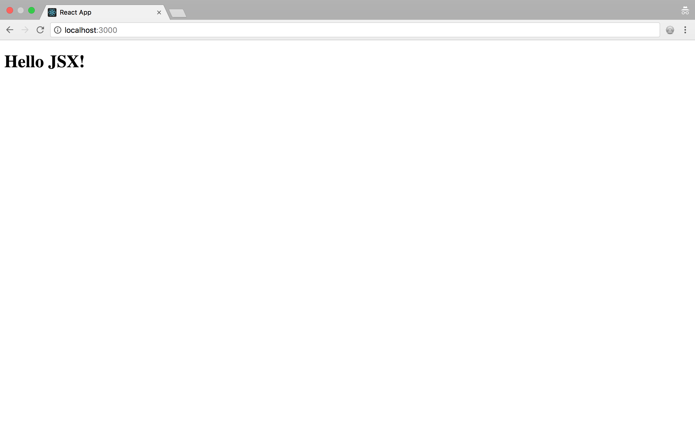

```javascript
const x = <h1>Hello JSX!</h1>;
```

Essa linha de código acima cria um componente do React que pode ser renderizado no browser.
Mesmo tendo uma sintaxe ainda estranha, acho que você consegue imaginar que ao executar isso dentro de uma aplicação React, será exibido um belo e grande "Hello JSX" no seu navegador.

Fica mais ou menos assim:

```javascript
import React from "react";
import ReactDOM from "react-dom";

const element = <h1>Hello JSX!</h1>;

ReactDOM.render(element, document.getElementById("root"));
```

Com o seguinte resultado:


## O que é JSX?

JSX nada mais é do que açucar sintático. Permite que o programador consiga escrever HTML dentro do javascript.


Se você ainda não reagiu a essa minha frase do mesmo jeito que o nosso amigo ai em cima, segura um pouco a onda e vem comigo.

#### HTML, CSS, Javascript

No desenvolvimento frontend, cada uma dessas tecnologias tem a sua função muito bem delimitada:

* HTML : É o que dá a estrutura da sua página. Diz como o seu documento será apresentado para o visitante da página.
* CSS : Descreve a lógica de como a página deve ser visualizada. Cores, fontes, tamanhos são definidos através do CSS.
* Javascript : É o que vai dar "vida" para a página. Através do JS, nós adcionamos comportamento, por exemplo, o que fazer quando o usuário clica em determinado botão.

E quando falamos de desenvolvimento de software um conceito extremamente importante, que tem mais relação com design do que codificação é o _Separation of Concerns_, cuja idéia central é manter cada responsabilidade isolada no seu próprio módulo.

Então quando olhamos para essas 3 tecnologias, fica fácil ligar os pontos e visualizar cada tecnologia em seu arquivo especifico, cumprindo sua função específica.

#### MVC

Padrões como MVC surgiram pra organizar a bagunça, e definitivamente servem pra dar um norte pro desenvolvimento de aplicações.

* Model: Responsável pela manipulação dos dados. Leitura, escrita, validação, transformação da informação.
* View : Camada responsável pela exibição dos dados.
* Controller : Recebe as requisições do usuário e determina quais classes/módulos do model serão acionados para a execução da lógica de negócio.

Trazendo o foco pro frontend, frameworks como o React, que focam na camada View, podem ser repensados e as aplicações construidas com ele pode ser estruturadas segundo o padrão MVC.

Então quando a gente pensa em manter cada responsabilidade confinada em seu arquivo específico (hmtl, css, javascript) é estranho abraçar a idéia que vem com o uso do JSX : javascript + html juntos.

## Abrace novas idéias

Pense em _Separation of Concerns_ de uma maneira diferente agora. Lembre-se que no React, a unidade mínima de trabalho é o Componente. Este sim deve ser isolado e cumprir apenas uma função, ou seja, se vc consegue pensar em uma aplicação frontend criando componentes pequenos e específicos, conseguimos reduzir o acoplamento e aumentar a coesão. E cumprimos o SoC sem problemas, mesmo mantendo html + js juntos!

Estressando mais ainda esse modelo, ainda podemos colocar o CSS no JS, assim, quando existir algum motivo pra alterar um componente, essa alteração vai se dar apenas em um único arquivo. É claro, mantenha seus componentes pequenos e reutilizáveis.

## Porque você deveria gostar do JSX?

Finalmente! Respondendo a pergunta do artigo, você deveria gostar do JSX pq ele facilita a criação dos seus componentes React.

Você poderia desenvolver suas aplicações sem ele, mas isso traria complexidade ao seu desenvolvimento. Veja:

Esse trecho de código abaixo:

```javascript
const componente = <h1 className="greeting">Hello JSX!</h1>;
```

Poderia ser escrito assim:

```javascript
const componente = React.createElement(
  "h1",
  props: {
    className: "greeting",
    children: "JSX"
  }
);
```

Bem melhor usar o JSX né? O Babel vai fazer todo esse trabalho pesado pra vc.

Uma última palavra : Se vc observou bem, viu que no meu exemplo acima, utilizei **className** ao invés do tradicional atributo **class** do HTML.

Isso acontece porque como JSX é em última instância Javascript, identificadores como class são desencorajados, por serem palavras reservadas do JS.

É isso por hoje. Sinta-se a vontade pra comentar, e vamo nessa!
